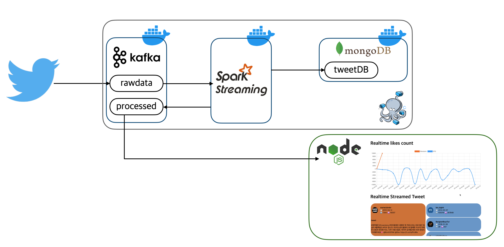
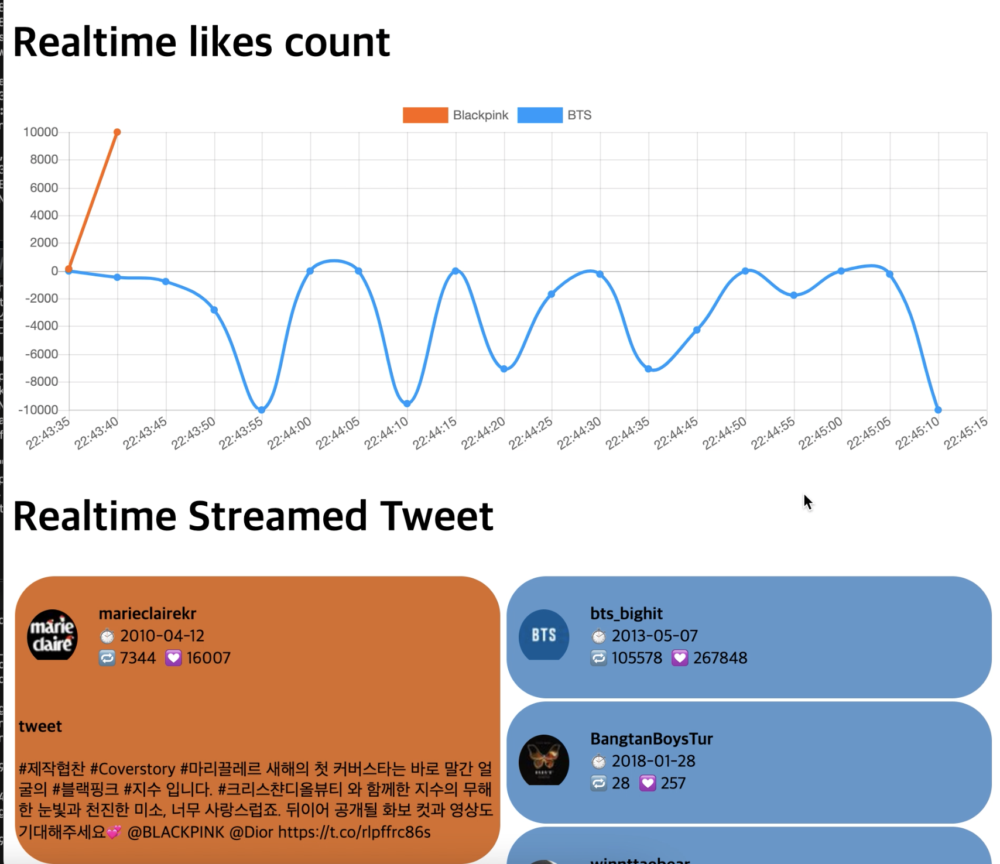

# Tweet stream data pipeline
이 프로젝트는 [TwitterLiveMaps프로젝트](https://github.com/seoyeong98/TwitterLiveMaps)를 기반으로 디벨롭한 프로젝트입니다. 파이프라인을 구성하는 각 스택을 컨테이너화했고, nodejs를 사용해 대시보드를 띄우는 웹을 추가했습니다.


# DemoVideo
[](https://youtu.be/lFgAhAfzUBI)

* 위 이미지 클릭 시 데모 비디오 영상으로 연결됩니다.


# Architecture


<kbd>tweepy api</kbd>를 사용해 "bts", "blackpink"를 포함하고 있는 트윗들을 <kbd>kafka</kbd> rawdata 토픽에 저장합니다.
<br/>
<kbd>spark streaming</kbd>에서 실시간 처리와 데이터 적재를 진행합니다. 한글 또는 영문 트윗만 남기고, 데이터가 어떤 그룹인지에 대한 정보를 담고, 좋아요 수가 0개 이상인 트윗만 쿼리해 <kbd>kafka</kbd>의 processed 토픽으로 스트리밍합니다. 카프카에 있는 원본 데이터는 <kbd>mongoDB</kbd>에 그대로 적재합니다. kafka의 processed에 있는 가공된 데이터는 실시간으로 웹 대시보드에 반영됩니다. 가공된 데이터를 두 개의 컬럼으로 보여주고 좋아요 수를 실시간으로 집계하여 시각화합니다.

<br/>

# How to use

## 환경 구성
.env copy, credentials copy, init-mongo.js copy 의 파일명을 각각 copy를 제외한 이름으로 변경 후, 파일 안에 있는 환경변수들을 개인적으로 수정합니다.

```bash
cd {download_directory}/RealTime-Dashboard-using-Docker 

docker-compose pull
docker-compose up -d
docker-compose ps
```
데이터 ETL작업을 위해 각 서버를 띄웁니다.
아래와 같이 컨테이너들이 정상적으로 기동되었다면 파이프라인을 위한 환경구성이 완료됩니다.


<br/>

## 데이터 수집
```bash
/usr/local/bin/python ./tweepyapi.py
```
카프카 토픽에 트윗 데이터를 수집합니다. tweepy api로부터 "bts", "blackpink" 키워드를 담고있는 트윗들이 rawdata 토픽에 저장됩니다.

```bash
docker-compose exec kafka sh 

$KAFKA_HOME/bin/kafka-console-consumer.sh --bootstrap-server localhost:9092 --topic rawdata --from-beginning
```
데이터가 잘 수집되었는지 확인합니다.

## 데이터 가공, 적재
```bash
docker-compose logs notebook
```
주피터노트북 접속 url을 확인 후 접속합니다. kafka_to_kafka_w_processing.ipynb 와
kafka_to_mongo_wo_processing.ipynb
파일을 실행시킵니다. <br>
이때 kafka_to_mongo_wo_processing.ipynb파일에 있는 mongoDB configuration을 수정해야합니다.

```bash
$KAFKA_HOME/bin/kafka-console-consumer.sh --bootstrap-server localhost:9092 --topic processed
```
가공된 트윗은 kafka의 processed 토픽에 produce됩니다. 카프카 kafka-console-consumer.sh를 실행시켜 데이터가 잘 적재되었는지 확인합니다.

```bash
docker-compose exec mongodb /bin/bash

mongo -u {user_name} -p {password} --authenticationDatabase {DB_NAME}

use {DB_NAME}

db.{collection_name}.find()
```
mongoDB 컨테이너에 접속하여 mongoDB에도 잘 적재되고있는지 확인합니다.

## 실시간 대시보드 웹
```
cd consumer
nodemon -L src/consumer.js
```
node를 띄우면 processed topic에 있는 데이터를 실시간으로 업데이트하는 대시보드 웹이 띄워집니다.



3000 포트로 접속하면 위와 같은 대시보드가 나타납니다.